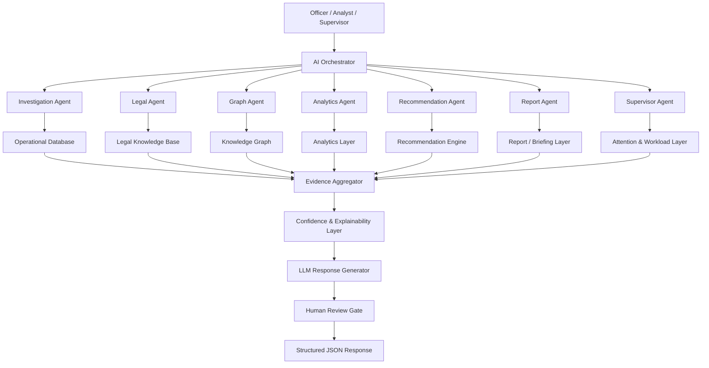
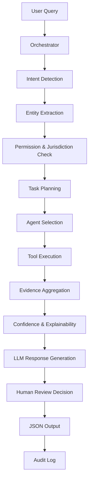

# AI Architecture

Purpose: define the overall AI Operating System architecture for KSP Intelligence OS.

This document replaces a single-chatbot mindset with an orchestrated, multi-agent, evidence-first intelligence system.

## Product Positioning

KSP Intelligence OS should not be designed as:

```text
User → LLM → Database → Answer
```

It should be designed as:

```text
User
  ↓
AI Orchestrator
  ↓
Specialized Agents
  ↓
Knowledge Graph + RAG + Analytics + Legal Engine + Recommendation Engine
  ↓
Evidence Aggregator
  ↓
LLM Response Generator
  ↓
Evidence-backed Response
```

## Core AI Principle

The AI is not one model.
The AI is a coordinated team of AI investigators operating under one command layer.

## High-Level AI System



## AI Folder Architecture

Recommended backend structure:

```text
backend/src/ai/
    orchestrator/
    agents/
        investigation/
        legal/
        analytics/
        graph/
        recommendation/
        reporting/
        supervisor/
    pipelines/
    rag/
    embeddings/
    vectorstore/
    prompts/
    tools/
    memory/
    parser/
    retrieval/
    reasoning/
    confidence/
    explainability/
    translation/
    voice/
    models/
    evaluation/
    tests/
```

## Primary Components

## 1. AI Orchestrator

The orchestrator is the command layer.
It receives every request first and decides:

- what the user is asking
- which context is active
- which agents should be called
- which tools they can use
- how outputs should be merged
- whether human review is required

### Responsibilities

- Intent detection
- Entity extraction initiation
- Permission and jurisdiction checks
- Task planning
- Agent routing
- Parallel agent execution
- Result merging
- Evidence completeness check
- Confidence scoring trigger
- Output contract enforcement
- Audit trail initiation

## 2. Specialized Agents

The platform should use domain agents instead of one generic chat agent.

| Agent | Primary Role |
|---|---|
| Investigation Agent | Case understanding, timeline, similarity, leads, repeat offender context. |
| Legal Agent | Acts, IPC/BNS/BNSS, section recommendation, punishment lookup, legal explanation. |
| Graph Agent | Relationship expansion, person-phone-vehicle-case links, shortest path, cluster context. |
| Analytics Agent | Trends, hotspot context, district comparison, forecasting inputs, victim statistics. |
| Recommendation Agent | Missing evidence, likely sections, prior FIR context, next best action, priority scoring. |
| Report Agent | Case briefs, supervisor reports, station reports, PDF-ready summaries. |
| Supervisor Agent | Attention dashboard, delayed cases, high-risk items, officer workload, escalations. |

## 3. Evidence Aggregator

This layer consolidates all non-LLM evidence before final answer generation.

### Inputs

- structured DB facts
- graph results
- legal sections and explanations
- analytics outputs
- recommendations
- similar case references
- RAG citations

### Responsibilities

- deduplicate facts
- label source types
- separate confirmed facts from inferred links
- surface missing facts
- prepare citation-ready context

## 4. Confidence Layer

Every answer must include:

- confidence score
- confidence label
- evidence count
- source quality indicators
- uncertainty reason
- review requirement flag

## 5. Explainability Layer

Every recommendation or AI answer must show:

- what was searched
- what evidence was found
- why a conclusion was formed
- what is missing
- whether human review is required

## 6. Human Review Gate

Critical outputs must be review-gated.
Examples:

- legal section recommendation
- high-risk person scoring
- repeat offender linkage
- hotspot patrol recommendation
- inferred gang relationship

## AI Request Lifecycle



## Data Sources Used by AI

| Layer | Source |
|---|---|
| Operational Facts | PostgreSQL / Prisma-backed police and intelligence schema |
| Legal Knowledge | IPC sections, acts, legal documents, manuals, SOPs |
| Graph Reasoning | Knowledge graph nodes and edges |
| Similarity / Retrieval | RAG collections, embeddings, vector store |
| Analytics | Crime statistics, hotspots, risk scores, review reports |
| Workflow Context | Session state, current case, user role, jurisdiction |

## Architectural Rules

1. The LLM never talks directly to raw SQL.
2. The LLM only sees curated tool outputs and evidence bundles.
3. Every agent uses explicit tools.
4. Legal facts must come only from legal knowledge sources.
5. Inferred graph links must never be presented as confirmed facts.
6. Sensitive outputs must be filtered by role and jurisdiction.
7. All AI outputs must fit a shared response contract.
8. Auditability is mandatory.
9. **No Third-Party APIs**: The AI runs entirely on-premise using a local LLM via Ollama. No case data is sent to third-party cloud providers, ensuring absolute data privacy for government deployments.

## Suggested Improvements Beyond Current Plan

### Improvement 1: Add a Safety / Governance Plane

Not an end-user agent, but a cross-cutting control layer for:

- role-based masking
- bias checks
- hallucination checks
- escalation checks
- unsafe recommendation prevention

### Improvement 2: Add a Retrieval Planner

Before agent execution, a lightweight retrieval planner should decide:

- which collections to query
- which tools to call first
- whether graph or legal retrieval is necessary
- how much context to retrieve

This reduces token waste and improves latency.

### Improvement 3: Add a Jurisdiction Filter Layer

Before any answer is composed, the system should filter outputs by:

- user role
- assigned unit
- assigned district
- case visibility scope
- sensitivity level

### Improvement 4: Add Evidence Freshness Metadata

Every response should include freshness indicators:

- record timestamp
- retrieval time
- model version
- whether evidence is operational, analytical, or inferred

## Deliverables Linked to This Architecture

This document is supported by:

- `docs/ai/agent_specifications.md`
- `docs/ai/tool_registry.md`
- `docs/ai/langgraph_workflow.md`
- `docs/ai/rag_architecture.md`
- `docs/ai/prompt_library.md`
- `docs/ai/ai_output_contract.md`
- `docs/ai/ai_reasoning_engine.md`
- `docs/ai/ai_modules.md`
- `docs/ai/ai_evaluation_framework.md`
- `docs/ai/voice_architecture.md`
- `docs/ai/ai_final_architecture_review.md`
