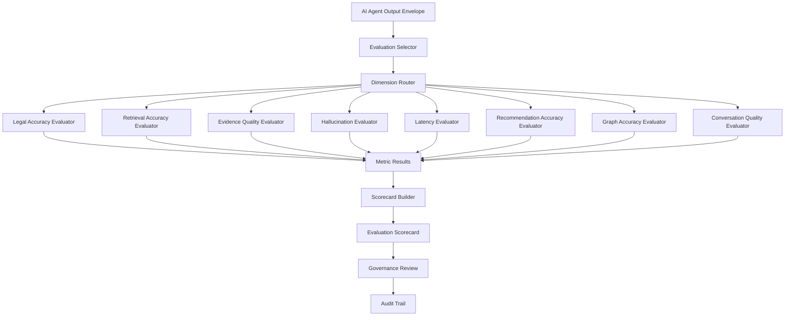

# AI Evaluation Framework

Purpose: define the evaluation architecture for measuring AI quality across all agents and capabilities in KSP Intelligence OS.

This document describes the evaluation types, dimensions, metrics, benchmarks, governance, and comparison contracts.
It does not define runtime evaluation logic or scoring algorithms.

Reference documents:

- `docs/ai/ai_architecture.md`
- `docs/ai/agent_specifications.md`
- `docs/ai/ai_reasoning_engine.md`
- `docs/ai/ai_output_contract.md`
- `docs/ai/rag_architecture.md`
- `docs/ai/prompt_library.md`
- `docs/ai/tool_registry.md`

## Core Principle

Every AI output must be measurable against evidence-backed benchmarks.
The AI is not evaluated as one system — it is evaluated per agent, per dimension, and per benchmark scenario.

## Evaluation Flow

## Evaluation Dimensions

| Dimension | Purpose | Primary Agents |
|---|---|---|
| Legal Accuracy | Verify legal section suggestions match reviewed benchmarks | Legal, Supervisor |
| Retrieval Accuracy | Measure precision and recall of retrieved evidence | Investigation, Analytics, Legal, Graph |
| Evidence Quality | Validate citation relevance, chain completeness, and conflict surfacing | All agents |
| Hallucination | Detect unsupported claims, contradictions, and overstatements | All agents |
| Latency | Track end-to-end, retrieval, graph, and first-token response times | All agents |
| Recommendation Accuracy | Evaluate acceptance alignment, priority calibration, and actionability | Recommendation, Investigation, Supervisor |
| Graph Accuracy | Validate link correctness, path quality, and algorithm consistency | Graph, Recommendation |
| Conversation Quality | Assess task completion, clarity, follow-up quality, and policy compliance | All agents |

## Metric Catalog

### Legal Accuracy Metrics

| Metric | Unit | Method | Target |
|---|---|---|---|
| Legal Section Match Rate | percentage | exact_match | ≥70%, ideal 90% |
| Legal Reasoning Sufficiency | score | expert_review | ≥75%, ideal 90% |
| Legal Applicability Precision | percentage | expert_review | ≥80%, ideal 95% |
| Legal Review Trigger Recall | percentage | automated_policy_check | ≥95%, ideal 100% |

### Retrieval Accuracy Metrics

| Metric | Unit | Method | Target |
|---|---|---|---|
| Retrieval Precision@K | percentage | retrieval_overlap | ≥70%, ideal 90% |
| Retrieval Recall@K | percentage | retrieval_overlap | ≥70%, ideal 90% |
| Retrieval Source Authority Score | score | citation_audit | ≥80%, ideal 95% |
| Retrieval Context Coverage | percentage | retrieval_overlap | ≥75%, ideal 90% |

### Evidence Quality Metrics

| Metric | Unit | Method | Target |
|---|---|---|---|
| Citation Relevance Score | score | citation_audit | ≥80%, ideal 95% |
| Evidence Sufficiency Score | score | expert_review | ≥75%, ideal 90% |
| Evidence Chain Completeness | score | citation_audit | ≥80%, ideal 95% |
| Conflicting Evidence Warning Rate | percentage | automated_policy_check | ≥90%, ideal 100% |

### Hallucination Metrics

| Metric | Unit | Method | Target |
|---|---|---|---|
| Unsupported Claim Rate | percentage | citation_audit | ≤5%, ideal 0% |
| Hallucination Block Precision | percentage | automated_policy_check | ≥85%, ideal 95% |
| Contradiction Rate | percentage | citation_audit | ≤3%, ideal 0% |
| Uncertainty Disclosure Rate | percentage | automated_policy_check | ≥95%, ideal 100% |

### Latency Metrics

| Metric | Unit | Method | Target |
|---|---|---|---|
| End-to-End Latency P95 | milliseconds | latency_percentile | ≤8000ms, ideal 3000ms |
| Retrieval Latency P95 | milliseconds | latency_percentile | ≤2500ms, ideal 1000ms |
| Graph Latency P95 | milliseconds | latency_percentile | ≤3000ms, ideal 1200ms |
| First Token Latency P95 | milliseconds | latency_percentile | ≤2500ms, ideal 900ms |

### Recommendation Accuracy Metrics

| Metric | Unit | Method | Target |
|---|---|---|---|
| Recommendation Acceptance Alignment | percentage | expert_review | ≥75%, ideal 90% |
| Recommendation Evidence Coverage | percentage | citation_audit | ≥95%, ideal 100% |
| Recommendation Priority Calibration | score | expert_review | ≥75%, ideal 90% |
| Recommendation Actionability Score | score | expert_review | ≥80%, ideal 95% |

### Graph Accuracy Metrics

| Metric | Unit | Method | Target |
|---|---|---|---|
| Graph Link Validation Rate | percentage | graph_validation | ≥80%, ideal 95% |
| Graph Explanation Clarity | score | expert_review | ≥75%, ideal 90% |
| Graph Path Correctness | percentage | graph_validation | ≥85%, ideal 95% |
| Graph Algorithm Result Consistency | score | graph_validation | ≥80%, ideal 95% |

### Conversation Quality Metrics

| Metric | Unit | Method | Target |
|---|---|---|---|
| Conversation Task Completion | percentage | conversation_review | ≥80%, ideal 95% |
| Conversation Clarity Score | score | conversation_review | ≥80%, ideal 95% |
| Conversation Follow-Up Quality | score | conversation_review | ≥75%, ideal 90% |
| Conversation Policy Compliance | percentage | automated_policy_check | ≥98%, ideal 100% |

## Agent-to-Dimension Mapping

Each agent is evaluated against a different subset of dimensions.

| Agent | Primary Dimensions | Secondary Dimensions |
|---|---|---|
| Investigation | retrieval_accuracy, evidence_quality, recommendation_accuracy | hallucination, latency, conversation_quality |
| Legal | legal_accuracy, evidence_quality, hallucination | retrieval_accuracy, latency, conversation_quality |
| Analytics | retrieval_accuracy, evidence_quality, latency | hallucination, conversation_quality |
| Graph | graph_accuracy, hallucination, evidence_quality | latency, conversation_quality |
| Recommendation | recommendation_accuracy, evidence_quality, hallucination | retrieval_accuracy, latency, conversation_quality |
| Report | conversation_quality, evidence_quality, hallucination | retrieval_accuracy, latency |
| Supervisor | recommendation_accuracy, conversation_quality, evidence_quality | hallucination, latency, retrieval_accuracy |

## Benchmark Dataset Profiles

| Dataset | Type | Supported Dimensions | Use Cases |
|---|---|---|---|
| legal-golden-set | golden_set | legal_accuracy, hallucination, conversation_quality | Section suggestion validation, legal rationale review |
| retrieval-benchmark-set | synthetic | retrieval_accuracy, evidence_quality, latency | RAG precision/recall, citation relevance, latency benchmarking |
| investigation-reviewed-cases | reviewed_case | recommendation_accuracy, conversation_quality, evidence_quality | Investigation lead quality, missing evidence recommendations |
| graph-validation-set | golden_set | graph_accuracy, hallucination, conversation_quality | Shortest path validation, community detection, centrality review |
| conversation-quality-set | synthetic | conversation_quality, hallucination, latency | Task completion, policy compliance, follow-up relevance |

## Dimension Weighting

Default weights for overall score computation:

| Dimension | Weight |
|---|---|
| Legal Accuracy | 0.18 |
| Evidence Quality | 0.18 |
| Hallucination | 0.16 |
| Retrieval Accuracy | 0.14 |
| Recommendation Accuracy | 0.12 |
| Latency | 0.08 |
| Graph Accuracy | 0.08 |
| Conversation Quality | 0.06 |

Legal accuracy and evidence quality are weighted highest because incorrect legal outputs and unsupported evidence carry the greatest operational risk in a policing context.

## Score Labels

| Label | Score Range |
|---|---|
| Poor | 0.00 – 0.49 |
| Fair | 0.50 – 0.74 |
| Good | 0.75 – 0.89 |
| Excellent | 0.90 – 1.00 |

## Evaluation Governance

### Review Requirements

- Critical failures require mandatory human review before benchmark approval.
- Legal accuracy dimension always requires human review regardless of pass/fail status.
- Automatic blocking is triggered when critical regression threshold (−15%) is breached.

### Escalation Rules

| Trigger | Threshold | Escalate To | Auto-Block |
|---|---|---|---|
| Critical regression | −15% vs baseline | AI Lead | Yes |
| Hallucination exceeded | >10% unsupported/contradiction | AI Lead | Yes |
| Legal accuracy below minimum | <70% match rate | Legal Review Officer | Yes |
| Graph accuracy below minimum | <80% link/path validation | AI Lead | No |
| Pass rate below threshold | <70% overall | AI Lead | No |
| Manual escalation | — | AI Lead | No |

### Audit Trail

Every evaluation action is recorded:

- Run started / completed / failed / cancelled
- Scorecard generated
- Review assigned / decision submitted
- Escalation triggered
- Threshold breached
- Comparison generated
- Suite created / updated

### Retention Policy

| Record Type | Retention |
|---|---|
| Scorecards | 365 days |
| Run results | 365 days |
| Audit logs | 730 days |
| Comparisons | 365 days |
| Archive after | 180 days |

## Cross-Agent Comparison

The framework supports comparing agents within a single run and across runs:

### Within-Run Comparison

- Rank agents by overall score.
- Identify dimension leaders (which agent scores highest per dimension).
- Surface strength and weakness dimensions per agent.

### Cross-Run Comparison (Regression Detection)

- Compare metric scores between baseline and current run.
- Detect regressions (>5% decline) and improvements (>5% gain).
- Flag critical regressions (>15% decline) for escalation.
- Track trends over multiple runs per agent and per dimension.

### Comparison Thresholds

| Threshold | Value |
|---|---|
| Regression | −5% |
| Improvement | +5% |
| Critical Regression | −15% |
| Unchanged Tolerance | ±2% |

## Implementation Files

| File | Purpose |
|---|---|
| `evaluation.types.ts` | Core types: dimensions, metric definitions, case references, scorecards, dataset profiles |
| `evaluation-metrics.ts` | 30 metric constant definitions across all 8 dimensions |
| `evaluation-components.interface.ts` | Per-dimension evaluator interfaces, reporter, selector |
| `evaluation-framework.interface.ts` | Framework capabilities, dependencies, main evaluate interface |
| `evaluation-contracts.ts` | Default capabilities, dataset profiles, weights, thresholds |
| `evaluation-agent-mapping.ts` | Agent-to-dimension mapping profiles and lookup utilities |
| `evaluation-benchmark.types.ts` | Benchmark scenario templates and batch evaluation run contracts |
| `evaluation-comparison.interface.ts` | Cross-agent and cross-run comparison interfaces |
| `evaluation-governance.types.ts` | Governance, escalation rules, audit trail, retention policy |

## Architectural Rules

1. Every metric must define a target range, failure severity, and evaluation method.
2. Every dimension must have at least one automated and one expert-review metric.
3. Legal and hallucination dimensions must always require human review for critical failures.
4. Cross-run comparisons must use consistent metric keys for delta computation.
5. Evaluation results must be auditable and traceable to the benchmark and agent that produced them.
6. Escalation rules must be configurable per deployment but ship with safe defaults.
7. Governance configuration must support both automated and manual review workflows.

## Suggested Improvements

### Improvement 1: LLM-as-Judge Integration

Add a later LLM-based evaluator that uses a separate model to judge output quality, particularly for conversation quality and evidence sufficiency dimensions where human review is expensive.

### Improvement 2: Continuous Evaluation Pipeline

Add a scheduled evaluation job that runs the benchmark suite nightly and publishes trend reports, catching regressions before they reach production.

### Improvement 3: Per-Jurisdiction Benchmarks

Create jurisdiction-specific benchmark datasets (e.g., Karnataka-specific legal sections, district-specific graph scenarios) to evaluate accuracy within operational scope.
