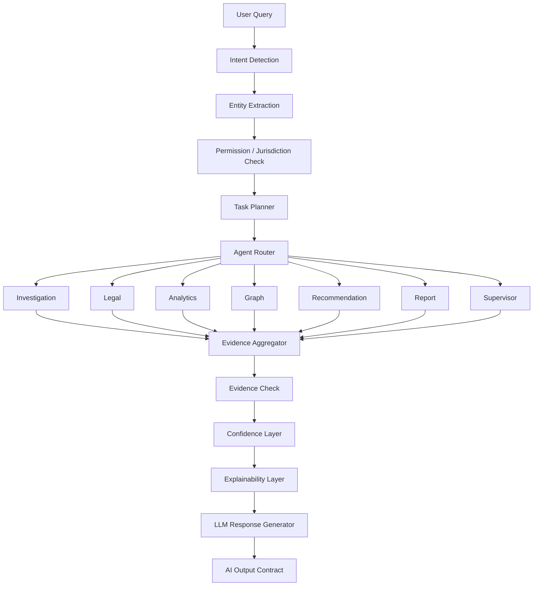

# AI Reasoning Engine

Purpose: define the reasoning behavior of KSP Intelligence OS as an AI Operating System, not a standalone chatbot.

Reference documents:

- `docs/ai/ai_architecture.md`
- `docs/ai/agent_specifications.md`
- `docs/ai/tool_registry.md`
- `docs/ai/langgraph_workflow.md`
- `docs/ai/rag_architecture.md`
- `docs/ai/prompt_library.md`
- `docs/ai/ai_output_contract.md`
- `docs/database/master_schema.md`
- `docs/database/knowledge_graph.md`

This document describes how the orchestrator and agents should reason.
It does not define backend code.

## Core Positioning

The AI should behave like a senior police investigation team coordinated by one commander.

```text
User
  ↓
AI Orchestrator
  ↓
Specialized Agents
  ↓
Evidence Aggregator
  ↓
Confidence + Explainability
  ↓
LLM Response Generator
  ↓
Structured Output
```

## AI Commander Model

The orchestrator acts as the AI Commander.
It does not do all domain reasoning itself.
It coordinates domain experts.

### Agent Team

- Investigation Agent
- Legal Agent
- Analytics Agent
- Graph Agent
- Recommendation Agent
- Report Agent
- Supervisor Agent

## Reasoning Principles

The system must always:

- retrieve evidence before generating explanation
- use tools instead of direct SQL access from the model
- separate facts, inferences, assumptions, and recommendations
- expose confidence and uncertainty
- require human review for sensitive outputs
- keep role and jurisdiction in scope

The system must never:

- invent FIRs, legal sections, evidence, or graph links
- declare guilt
- hide missing facts
- overstate inferred graph relationships
- bypass legal source of truth

## End-to-End Reasoning Sequence



## Reasoning Stages

## 1. Intent Detection

The orchestrator classifies the request into one or more intents:

- case summary
- FIR validation
- legal recommendation
- similar case discovery
- person lookup
- graph exploration
- hotspot explanation
- analytics comparison
- crime forecasting
- supervisor attention summary
- report generation

## 2. Entity Extraction

The orchestrator and parser identify:

- case IDs
- FIR / crime numbers
- people / victims / accused
- phones / vehicles / accounts
- districts / stations / locations
- time windows
- legal terms
- crime indicators

## 3. Permission and Jurisdiction Check

Before retrieval, the system must determine:

- whether the user can see the case
- whether sensitive identifiers must be masked
- whether legal or supervisory outputs require scope limits

## 4. Task Planning

The orchestrator decides:

- which agents are required
- which tools each agent may call
- which retrieval collections are needed
- whether execution should be parallel or sequential

## 5. Agent Execution

Each agent performs narrow domain reasoning.
The LLM is used only after evidence retrieval and agent execution.

## 6. Evidence Aggregation

The system merges:

- database facts
- graph context
- legal references
- analytics outputs
- recommendations
- RAG citations

## 7. Confidence and Explainability

The system scores the answer based on:

- number of sources
- source quality
- cross-agent consistency
- missing facts
- review state of retrieved records

## 8. Response Generation

The LLM converts curated evidence into a structured user-facing answer.
It must follow the shared output contract.

## Investigation Memory

The platform should use investigation memory, not generic chat memory.

### Investigation Memory Components

- current case context
- officer role
- jurisdiction
- previous queries in the same session
- retrieved evidence bundle
- temporary resolved references like “his”, “that accused”, “that phone”

### Example

If the officer first asks:

```text
Show accused 2 in FIR 2026-001.
```

and later asks:

```text
Show his phone.
```

memory should resolve `his` to the previously focused accused in the active case context.

## Tool-First Rule

The model never issues SQL.
It only uses explicit tools defined in `tool_registry.md`.

## Confidence Requirements

Every answer must include:

- confidence label
- confidence score
- reason for confidence
- evidence references
- whether AI-generated content requires review

## Hallucination Prevention

To reduce hallucination risk:

- no legal answer without legal retrieval
- no graph conclusion without graph evidence
- no analytics answer without statistical source
- no recommendation without supporting facts
- no hidden fallback that fabricates missing results

## Human Review Rules

Human review is mandatory when the response includes:

- legal section suggestion
- risk score interpretation for action
- repeat offender identity linkage
- gang or network inference
- hotspot operational recommendation
- evidence gap assertions affecting case outcome

## Output Shape

All final answers must follow `docs/ai/ai_output_contract.md`.

## Suggested Improvement

Add a later **Evidence Sufficiency Score** before response generation.
This score would help the orchestrator decide whether to:

- answer directly
- ask a clarifying question
- trigger more retrieval
- escalate to human review immediately
