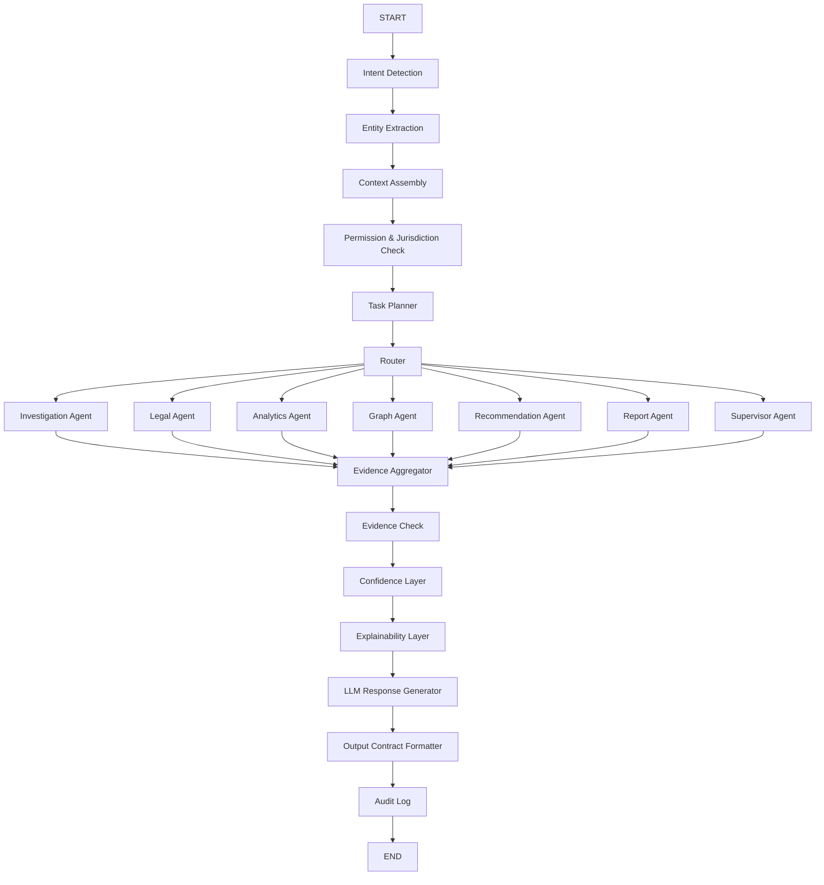

# LangGraph Workflow

Purpose: define the node-by-node orchestration workflow for the AI Operating System.

This document assumes LangGraph-style orchestration, but avoids overcommitting to framework-specific abstractions.

## Design Principle

The graph should represent an investigation workflow, not a chatbot loop.

## High-Level Flow



## State Object

Recommended shared workflow state:

```text
query
user_context
screen_context
current_case_context
intent
entities
permissions
jurisdiction
task_plan
selected_agents
tool_calls
retrieved_evidence
graph_evidence
legal_evidence
analytics_evidence
recommendation_evidence
warnings
confidence
review_required
final_output
```

## Node Definitions

## 1. Intent Detection Node

### Input
- raw user query
- current screen
- current case context

### Output
- primary intent
- secondary intent
- urgency
- response type

## 2. Entity Extraction Node

### Input
- query text
- case/screen context

### Output
- cases
- people
- locations
- vehicles
- phones
- legal terms
- dates
- crime indicators
- missing entities

## 3. Context Assembly Node

### Input
- user role
- jurisdiction
- open case
- previous turns

### Output
- active working context
- memory references
- sensitivity boundaries

## 4. Permission and Jurisdiction Check Node

### Responsibilities
- validate role permissions
- apply district/unit scope
- mask disallowed fields
- stop unsafe queries early

## 5. Task Planner Node

### Responsibilities
- decide which agents are needed
- decide which tools are needed
- decide execution order
- decide whether to run agents in parallel

### Example

Query:

```text
Find all repeat offenders in Mysuru involved in burglary.
```

Task plan:

- Investigation Agent: burglary case retrieval
- Analytics Agent: district crime trend context
- Graph Agent: linkage expansion
- Recommendation Agent: prioritize cases/offenders

## 6. Router Node

### Routing Rules

| Query Type | Agent Route |
|---|---|
| Case summary / timeline / similarity | Investigation Agent |
| Acts / IPC / punishment / legal explanation | Legal Agent |
| Trends / forecasts / comparisons / hotspots | Analytics Agent |
| Relationships / paths / gangs / linked phones | Graph Agent |
| Next actions / missing evidence / priority | Recommendation Agent |
| Briefings / exports / summaries | Report Agent |
| Attention dashboard / workload / escalations | Supervisor Agent |

## 7. Agent Execution Nodes

Agents should operate mostly in parallel when safe.

### Parallel-safe combinations

- Investigation + Legal
- Investigation + Graph
- Analytics + Recommendation
- Legal + Similar-case retrieval

### Sequential-only cases

- recommendation depending on graph result
- final legal suggestion depending on extracted facts
- report generation depending on investigation summary

## 8. Evidence Aggregator Node

### Responsibilities
- merge agent outputs
- deduplicate evidence
- label facts vs inference
- attach citations
- summarize quality gaps

## 9. Evidence Check Node

### Responsibilities
- verify enough evidence exists to answer
- decide if clarification is needed
- decide if review gate is required

Possible outcomes:

- `enough_evidence`
- `needs_more_retrieval`
- `needs_clarification`
- `needs_human_review`

## 10. Confidence Layer Node

### Inputs
- source count
- source quality
- consistency across agents
- missing facts
- review status

### Outputs
- confidence score
- confidence label
- confidence reason

## 11. Explainability Layer Node

### Responsibilities
- produce reasoning summary
- identify supporting evidence
- identify missing evidence
- expose why recommendation was formed

## 12. LLM Response Generator Node

The LLM should:

- not search raw data on its own
- not create new facts
- only synthesize curated evidence
- produce readable language and structured sections

## 13. Output Contract Formatter Node

This node guarantees that all responses follow one JSON contract.

## 14. Audit Log Node

Must record:

- user
- time
- intent
- selected agents
- tools called
- major evidence sources
- confidence
- review requirement
- output type

## Example Routing Scenarios

### Scenario A: Legal query

```text
What sections apply to this FIR?
```

Route:
- Investigation Agent
- Legal Agent
- Recommendation Agent

### Scenario B: Graph query

```text
Show all links for this phone number.
```

Route:
- Graph Agent
- Investigation Agent

### Scenario C: Supervisor query

```text
What needs my attention today?
```

Route:
- Supervisor Agent
- Analytics Agent
- Recommendation Agent

## Suggested Improvement

Add a **Retrieval Budget Node** later.

This node would cap:

- number of tool calls
- number of retrieved chunks
- graph expansion depth
- token budget per answer

That will improve latency and reduce noisy evidence bundles.
