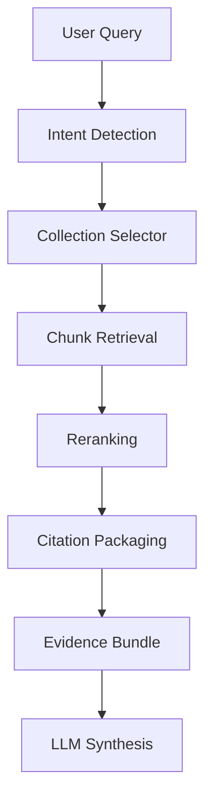

# RAG Architecture

Purpose: define retrieval-augmented generation architecture for KSP Intelligence OS.

## Core Principle

Do not build one giant knowledge base.
Split RAG into multiple collections with different retrieval rules.

## RAG Collections

| Collection | Purpose | Example Content |
|---|---|---|
| Legal | Legal reasoning support | Acts, IPC/BNS/BNSS sections, punishments, legal manuals |
| FIR Narratives | Similar case discovery and narrative support | FIR brief facts, narrative extracts, MO notes |
| Crime Reports | Analytics explanation | Crime review PDFs, district reports, monthly review summaries |
| Investigation SOP | Workflow support | police manuals, SOPs, process notes |
| Evidence / Documents | Case-specific support | documents, forensic summaries, evidence descriptions |
| Supervisor Briefing | operational reporting | generated reports, approved summaries, attention notes |

## Retrieval Flow



## Collection Selection Rules

| Intent | Collections |
|---|---|
| Legal recommendation | Legal, FIR Narratives, Investigation SOP |
| Case similarity | FIR Narratives, Evidence / Documents |
| Crime analytics explanation | Crime Reports, Analytics summaries |
| Chargesheet / workflow support | Investigation SOP, Legal, Evidence / Documents |
| Chat investigation | FIR Narratives, Legal, Crime Reports, Evidence / Documents |

## Chunking Strategy

## Legal Collection
- chunk by act / section / subsection
- preserve section number and act code
- attach punishment and explanation fields

## FIR Narratives
- chunk by FIR / case narrative
- optionally split into:
  - complaint summary
  - incident facts
  - accused indicators
  - evidence indicators
  - legal sections

## Crime Reports
- chunk by report section / topic / district summary
- preserve month/year/source metadata

## SOP / Manuals
- chunk by topic and procedural step
- preserve workflow headings and policy references

## Metadata Per Chunk

Every chunk should contain:

- collection name
- source document ID
- source dataset
- case ID if applicable
- act / section if applicable
- district / unit if applicable
- date / reporting period
- sensitivity level
- review status
- checksum or source version

## Embeddings Strategy

### Separate embedding purpose by collection

| Collection | Embedding Focus |
|---|---|
| Legal | semantic legal meaning and keywords |
| FIR Narratives | crime fact similarity and MO semantics |
| Crime Reports | trend/summary semantics |
| SOP | procedural instruction semantics |

## Retrieval Pipeline

1. query understanding
2. collection selection
3. lexical retrieval (BM25 / keyword)
4. semantic retrieval (embedding similarity)
5. metadata filtering
6. reranking
7. citation packaging

## Reranking Rules

Prefer chunks that have:

- higher semantic match
- same case / district if relevant
- reviewed or trusted status
- stronger metadata alignment with extracted entities
- higher legal specificity for law queries

## Citation Rules

Each answer should reference:

- source type
- source title / table / document
- case number or legal section where relevant
- chunk identifier or record ID if possible

## Hallucination Prevention Rules

- If retrieval returns no strong legal chunk, do not invent a section.
- If retrieval returns weak case similarity, label it as low confidence.
- If chunks conflict, surface conflict rather than hide it.
- If chunk quality is poor, state that the answer is provisional.

## Role and Sensitivity Handling

RAG output must respect:

- officer role
- jurisdiction
- case scope
- masking requirements for victims and sensitive identifiers

## Suggested Improvement

Add a **Hybrid Retrieval Score** for each chunk:

```text
final_score = semantic_score + lexical_score + metadata_match + source_trust - sensitivity_penalty
```

This will make retrieval more predictable and easier to debug.
