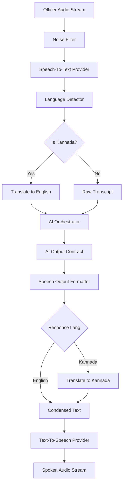

# Voice AI Architecture

Purpose: define the architecture for the voice interaction layer in KSP Intelligence OS, supporting hands-free field operations for officers in Kannada and English.

This document describes the voice pipeline, STT/TTS contracts, translation integration, streaming architecture, noise handling, and interruption policies. It does not contain runtime implementation.

Reference documents:
- `docs/ai/ai_architecture.md`
- `docs/ai/ai_output_contract.md`
- `docs/ai/ai_reasoning_engine.md`

## Core Principles

1. **Bilingual by Default**: The system must seamlessly support English (office use) and Kannada (field use), including mid-sentence code-switching.
2. **Built for the Field**: Noise handling and interruption (barge-in) policies must be robust enough for traffic, crowds, and moving vehicles.
3. **Speech-Optimized Output**: The verbose JSON AI output contract must be condensed into a concise, naturally spoken format before TTS synthesis, while retaining critical warnings and recommendations.
4. **Legal Precision**: STT and translation pipelines must strictly preserve legal section numbers, act codes, and case identifiers without phonetic distortion or mistranslation.

## Voice Conversation Pipeline

The end-to-end voice pipeline manages the conversion from raw audio to orchestrator action and back to spoken response.

## Speech-To-Text (STT)

### Streaming and Interim Results
The STT interface supports streaming recognition via `AiSpeechToTextStreamHandler`. This allows the UI to display interim transcripts in real-time before the officer finishes speaking, reducing perceived latency.

### Auto Language Detection
In field scenarios, officers may not explicitly set a language toggle. The `AiLanguageDetector` identifies if the spoken utterance is English, Kannada, or code-switched, routing it to the translation module if necessary.

### Domain-Specific Phrase Boosting
To improve accuracy on critical terminology, the STT configuration includes `AiSttDomainBoostEntry` configurations:
- **Legal Sections**: IPC, BNS, CrPC (Weight: 1.5)
- **Police Ranks**: DGP, SP, Inspector, SHO (Weight: 1.3)
- **Case Identifiers**: FIR, Crime Number (Weight: 1.4)
- **Geographic**: District and station names (Weight: 1.2)

## Noise Handling

Field environments require aggressive pre-processing. The `AiNoiseFilter` applies specific policies based on the environment preset:

| Environment | Noise Reduction | AGC | Echo Cancellation | VAD Aggressiveness |
|---|---|---|---|---|
| quiet_office | Off | On | Off | Low |
| police_station | On | On | On | Medium |
| traffic | On | On | Off | High |
| crowd | On | On | On | High |
| vehicle | On | On | Off | Medium |

## Translation Integration

When Kannada is used, the system utilizes the Translation module (`AiTranslationProvider`).

### Legal Term Preservation
A critical requirement is that legal terms are not mistranslated (e.g., "IPC 302" should not be translated into a literal Kannada word).
The `AiTranslationProvider` uses preservation rules for:
- Legal Sections & Act Codes (Always preserved)
- Case/FIR Identifiers (Always preserved)
- Phone/Vehicle Numbers (Always preserved)
- Person/Place Names (Transliterated, not translated)

### Police Glossary
A domain-specific `AiLegalGlossary` maps standard police terminology, ranks, and procedural terms between English and Kannada to ensure professional consistency.

## Text-To-Speech (TTS)

### Speech Output Formatter
The `AiSpeechOutputFormatter` intercepts the standard `AiAgentOutputEnvelope` before TTS generation.
It condenses verbose arrays (like 10 graph edges or 5 retrieval citations) into a brief summary.
*Example*: "I found 3 similar cases from Mysuru. The highest match is FIR 12/2026. Would you like me to read the case summary?"

Critical elements (warnings, review requirements, legal recommendations) are **never** condensed away.

### Voice Profiles
4 standard profiles are configured:
1. `en-in-male-professional`: English (India) Male
2. `en-in-female-professional`: English (India) Female
3. `kn-in-male-professional`: Kannada Male
4. `kn-in-female-professional`: Kannada Female

Profiles are selected based on user preference or context urgency (e.g., alert notifications may use a specific profile).

## Interruption (Barge-in) Policy

The system supports officer barge-in (interrupting the AI while it speaks).

| Policy Mode | Behavior | Use Case |
|---|---|---|
| allow_barge_in | User speech immediately stops TTS | Standard conversation, querying facts |
| ignore_during_critical | User speech is ignored until TTS finishes | Legal recommendations, escalation alerts, risk warnings |
| queue_after_response | User speech is recorded but TTS completes first | Briefings, report generation |

## Session Context

The `AiVoiceSessionContext` links the continuous audio stream to the underlying `AiSessionMemory`, tracking:
- Interruption state
- Current noise policy
- Active turn count
- Consecutive no-speech timeouts (for auto-closing the microphone)

## Future Considerations

1. **Edge STT**: For deep rural areas without connectivity, a lightweight on-device STT model could handle basic commands.
2. **Speaker Diarization**: If multiple officers/witnesses are speaking into one device, diarization could separate speakers in the transcript.
3. **Emotion Detection**: Analyzing speech prosody for stress/urgency to automatically escalate the session priority.
